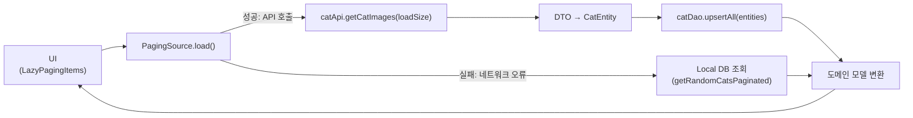

# 고양이 앱 (CatsApp)

고양이 앱은 다양한 고양이 이미지를 보여주고 관리할 수 있는 안드로이드 애플리케이션입니다.

## 목차

- [프로젝트 소개](#프로젝트-소개)
- [개발/실행 환경](#개발실행-환경)
- [주요 기능](#주요-기능)
- [기술 스택](#기술-스택)
- [프로젝트 구조](#프로젝트-구조)
- [모듈 의존관계](#모듈-의존관계)
- [레이어별 책임과 모듈](#레이어별-책임과-모듈)
- [데이터 흐름](#데이터-흐름)

## 프로젝트 소개

고양이 앱은 고양이 이미지를 페이징 처리하여 보여주는 애플리케이션입니다. 사용자는 다양한 고양이 이미지를 스크롤하여 볼 수 있으며, 특정 이미지를 선택하여 상세 정보를 확인할 수
있습니다. 네트워크 상태를 모니터링하여 오프라인 상태에서도 사용자 경험을 최적화했습니다.

## 개발/실행 환경

- 운영체제: macOS, Windows, Linux
- Android Studio: Meerkat | 2024.3.1 Patch 2
- Kotlin 버전: 2.1.10
- Java 버전: 17
- 최소 SDK 버전: 26
- 타겟 SDK 버전: 35
- Gradle 버전: 8.9.0

## 주요 기능

1. 고양이 이미지 목록 보기
    - 무한 스크롤 지원 (페이징)
    - 그리드 뷰로 이미지 표시

2. 상세 정보 보기
    - 고양이 이미지 전체 화면으로 보기
    - 고양이 상세 정보 표시

3. 네트워크 상태 처리
    - 오프라인 상태 감지 및 처리
    - 네트워크 연결 복구 시 자동 재시도

4. 화면 방향 최적화
    - 세로/가로 모드 모두 지원
    - 가로 모드에서 3열 그리드 레이아웃 적용

## 기술 스택

| 카테고리   | 기술                       |
|--------|--------------------------|
| 언어     | Kotlin                   |
| UI     | Jetpack Compose          |
| 아키텍처   | MVVM, Clean Architecture |
| 비동기 처리 | Coroutines, Flow         |
| 네트워킹   | Retrofit                 |
| 이미지 로딩 | Coil                     |
| 의존성 주입 | Hilt                     |
| 페이징    | Paging 3                 |
| 네비게이션  | Navigation Compose       |
| 로깅     | Timber                   |

## 프로젝트 구조

프로젝트는 모듈화된 구조를 사용하여 다음과 같이 구성되어 있습니다:

```
CatsApp/
├── app/                        # 애플리케이션 모듈
├── build-logic/                # 빌드 로직 모듈
├── core/                       # 핵심 모듈
│   ├── common/                 # 공통 유틸리티
│   ├── data/                   # 데이터 접근 계층
│   ├── data-api/               # API 정의
│   ├── database/               # 로컬 데이터베이스
│   ├── domain/                 # 비즈니스 로직
│   ├── model/                  # 데이터 모델
│   ├── network/                # 네트워크 통신
│   └── ui/                     # UI 관련 리소스 및 테마
└── feature/                    # 기능 모듈
    └── cats/                   # 고양이 관련 기능
```

앱은 모듈화된 아키텍처와 MVVM 패턴을 사용하여 책임을 분리하고 유지보수성을 향상시켰습니다. 각 모듈은 서로 분리되어 있어 독립적인 개발과 테스트가 가능합니다.

## 모듈 의존관계

```
                             
      core:network ─┐        
                    │        
      core:database ┼─> core:data ──> core:data-api <── core:domain <── feature:cats
                    │                                                       ▲
      core:common ──┘                                                       │
                                                                            │
                                                                         app (Shell)
```

이 의존관계도는 단방향 의존성 원칙을 따르며, 모듈 간의 명확한 경계를 보여줍니다. 특히 data-api 모듈이 도메인과 데이터 레이어 사이에서 인터페이스 역할을 하여 도메인
레이어가 구체적인 데이터 구현에 직접 의존하지 않도록 하는 클린 아키텍처 원칙을 적용했습니다.

## 레이어별 책임과 모듈

### 1. 프레젠테이션 레이어

**책임**: 사용자 인터페이스 표시 및 사용자 상호작용 처리

- **app**: 애플리케이션 셸, 내비게이션, 기본 UI 구성
- **feature:cats**: 고양이 이미지 목록 및 상세 화면
- **core:ui**: 공통 UI 컴포넌트, 테마, 스타일

### 2. 도메인 레이어

**책임**: 비즈니스 로직 및 유스케이스 정의

- **core:model**: UI 에서 사용할 도메인 모델
- **core:domain**: 유스케이스, 엔티티, 비즈니스 규칙
    - `GetCatImagesUseCase`: 고양이 이미지 데이터 페이징 처리
    - `GetCatDetailUseCase`: 특정 고양이 상세 정보 조회

### 3. 데이터 레이어

**책임**: 데이터 소스 추상화 및 저장소 구현

- **core:data**: 저장소 구현, 데이터 매핑, 캐싱 전략
- **core:data-api**: 저장소 인터페이스
- **core:network**: 네트워크 통신
- **core:database**: 로컬 데이터베이스 액세스 및 테이블 정의

### 4. 공통 레이어

**책임**: 여러 레이어에서 공유되는 유틸리티 및 확장 함수

- **core:common**: 네트워크 감시

## 데이터 흐름

앱에서 고양이 이미지를 로드하는 데이터 흐름은 다음과 같습니다.



### 데이터 흐름 세부 과정

1. **UI 요청**:
    - LazyPagingItems가 페이지를 요청하면 Pager가 PagingSource.load() 호출

2. **네트워크 요청**:
    - catApi.getCatImages(loadSize)를 호출하여 원격 API에서 고양이 이미지 데이터 요청

3. **성공 시나리오**:
    - DTO → CatEntity로 변환
    - catDao.upsertAll()을 통해 DB에 데이터 캐싱
    - Entity → Domain Model 변환 후 UI에 데이터 방출

4. **네트워크 실패 시나리오 (IOException, 5xx)**:
    - DB에서 getRandomCatsPaginated(limit, offset)를 통해 로컬 데이터 페이징
    - Entity → Domain Model 변환 후 UI에 데이터 방출

5. **클라이언트 에러 (4xx 등)**:
    - LoadResult.Error 반환하여 사용자에게 에러 상태 표시
    - UI에서 적절한 에러 처리 및 재시도 옵션 제공

이 아키텍처는 네트워크 상태와 무관하게 일관된 사용자 경험을 제공하며, 로컬 캐싱을 통해 오프라인 상태에서도 앱 사용이 가능합니다.

## RemoteMediator 대신 PagingSource를 구현한 이유

안드로이드 Paging 3 라이브러리에서는 네트워크와 로컬 데이터베이스를 함께 사용할 때 일반적으로 RemoteMediator를 권장하지만, 본 프로젝트에서는 다음과 같은 이유로
PagingSource를 선택했습니다.

### 1. 단일 load() 안에서 네트워크 ↔ 로컬 분기 처리

PagingSource의 load() 내부에서

- 네트워크 시도 → 성공 시 DB에 저장 후 반환
- IOException/5xx 시 로컬 DB 페이징 호출 → 반환
- 4xx 에러 시 LoadResult.Error

이 한 메서드 안에서 "네트워크 vs 로컬" fallback 로직을 집중적으로 구현하기가 편했습니다.

RemoteMediator를 쓰면 네트워크 호출과 DB upsert는 Mediator에, 로컬 조회는 PagingSource에 분산되어 들어가야 해서 오히려 코드 분리·흐름 파악이
복잡해집니다.

### 2. 오프라인→온라인 전환 시점 제어

PagingSource 내에서 networkWatcher.isOnline() 을 매 요청마다 확인하고

- 오프라인일 땐 "마지막 페이지 이후 에러"를 던지고
- 온라인일 땐 바로 API 호출

UI의 retry() 호출만으로 중간 네트워크 전환을 자연스럽게 반영할 수 있었습니다.

RemoteMediator는 initialize() 또는 LoadType.REFRESH/APPEND 시 한정된 흐름만 제공하므로, "중간 네트워크 전환에 따른 즉각적인 retry
분기"를 PagingSource 한 곳에서 짜는 편이 수월했습니다.

- RemoteMediator는 refresh를 하면 db에서 데이터를 가져올때 이전의 모든 페이지도 다같이 새로 불러와졌습니다.

결국 refresh 전략, db와 api 호출에 대한 유연성을 위해 PagingSource를 선택했습니다.
